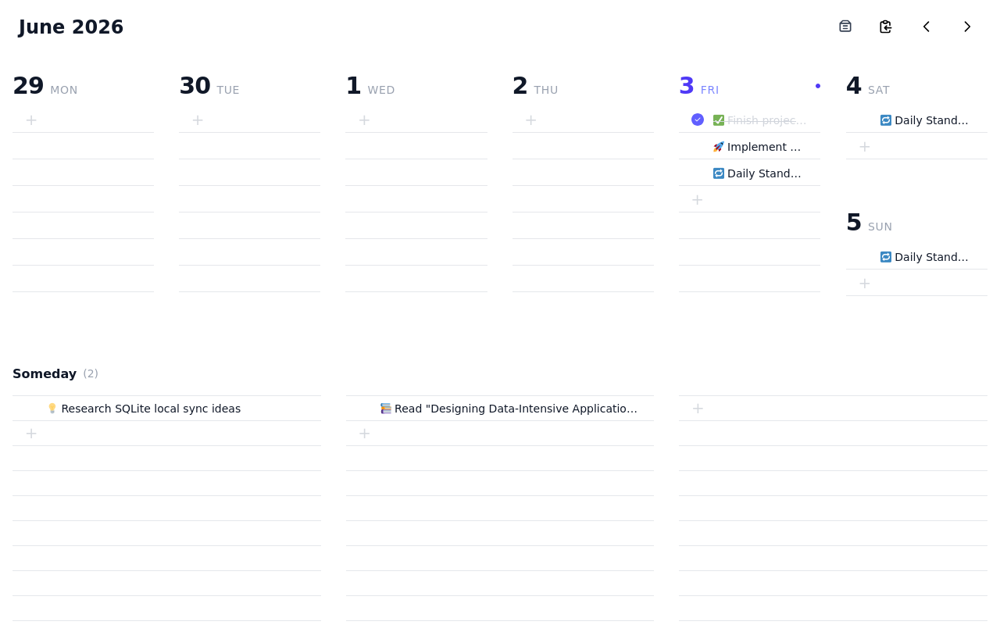

# Zeek

A local-first weekly planner inspired by [gogo-invoice](https://github.com/hallucinogen/gogo-invoice). The app runs entirely in your browser after the assets load — there is **no server, no database, no auth**. All planner state lives in `localStorage`, and JSON backup/export is the official recovery mechanism.

* **Hosted Web App:** [https://zeek-app.pages.dev/#/](https://zeek-app.pages.dev/#/)

## Overview

### Week View


### Task Details Popup


## Run Locally

```bash
deno task dev      # or: npm run dev   → vite dev server (default http://localhost:5173)
deno task build    # or: npm run build → static site in dist/ (host anywhere / open via file://)
```

## Runtime contract

- All state is stored locally in the browser under versioned keys
  (`zeek.planner.data.v1`, `zeek.planner.lastGood.v1`, `zeek.planner.snapshots.v1`,
  `zeek.planner.corrupt.*`). Clearing site data erases your planner — export a
  backup first.
- JSON backup is the only full-fidelity, restorable format. Markdown is
  human-readable only.
- Dates are stored as local calendar strings `YYYY-MM-DD` (never JS timestamps),
  so there is no timezone/DST drift.
- Restore is **replace-only** for now (no merge). Every replace/reset creates a
  pre-change snapshot you can restore from the Data page (`/#/data`).

## Data page

`/#/data` shows storage diagnostics, lets you download/copy a JSON backup,
export Markdown, run a dry-run import preview, replace data (with a pre-import
snapshot), and recover from or discard quarantined corrupt payloads.

## Agent API & Integration

A documented `window.Zeek` global is exposed after the app boots. It goes through the same Zod-validated store actions as the UI and returns JSON-safe clones; invalid input returns structured errors instead of partially mutating.

* **Local Documentation:** [AGENT_GUIDE.md](AGENT_GUIDE.md)
* **Public / Hosted Documentation:** [https://zeek-app.pages.dev/AGENT_GUIDE.md](https://zeek-app.pages.dev/AGENT_GUIDE.md)
* **Recommended Headless Browser:** [Obscura](https://github.com/h4ckf0r0day/obscura) (lightweight, Rust-based headless browser engine for agent navigation)

### Sample Prompt for AI Agents

If you are using an AI coding assistant (like Claude, Gemini, etc.) and want to instruct it to interact with or manipulate your planner data programmatically via browser automation (e.g. Playwright/Puppeteer), you can use the following prompt:

> "I want you to manage my weekly planner tasks at https://zeek-app.pages.dev/#/. Before taking any actions, please read and study the agent guide located at https://zeek-app.pages.dev/AGENT_GUIDE.md to understand the available `window.Zeek` API methods, schemas, and invariants. Once you have studied the guide, proceed to [describe your task here, e.g., list today's tasks or schedule a recurring meeting]."

```js
await window.Zeek.ready
window.Zeek.help()                              // methods, invariants, versions
window.Zeek.getData()                          // canonical PlannerDataV1
window.Zeek.getDiagnostics()                   // storage status
window.Zeek.exportData({ format: 'backup' })    // 'backup' | 'raw' | 'markdown'
window.Zeek.importData(input, { dryRun: true }) // dry-run preview, no mutation
window.Zeek.importData(input, { mode: 'replace' })
window.Zeek.validateData(input)
window.Zeek.list({ week_start: '2026-07-06' })
window.Zeek.create({ title: 'Task', date: '2026-07-06' })
window.Zeek.update(id, { completed: true })
window.Zeek.move(id, { date: '2026-07-08' })    // or { date: null, someday_column: 1 }
window.Zeek.delete(id)
```

### Key invariants

- `date === null` means Someday; `someday_column` must then be `0 | 1 | 2`.
  Dated tasks have `someday_column === null`.
- Recurrence templates: `recurrence_type !== 'none' && recurrence_parent_id === null`.
  Generated instances: `recurrence_parent_id !== null`, start incomplete.
- `recurrence_weekdays` maps `0 = Sunday … 6 = Saturday`.
- Subtasks are **not** cloned into generated recurrence instances.
- Deleting a generated instance records a `recurrence_exception` so it is not
  recreated. Editing a template disposes strictly-future instances and
  preserves past occurrences (and today's).


